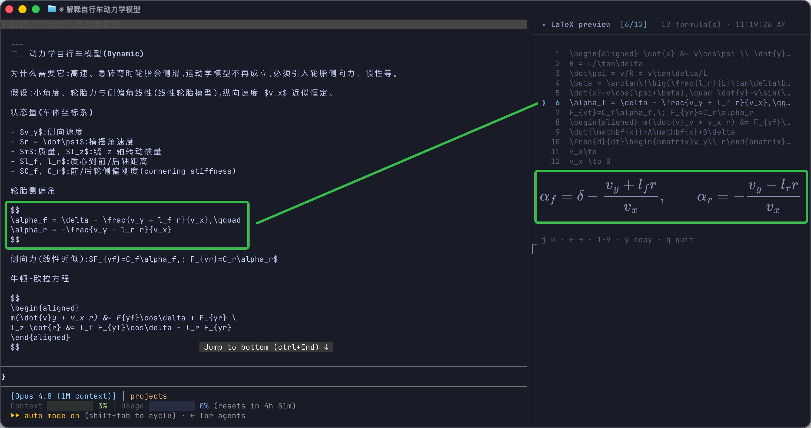
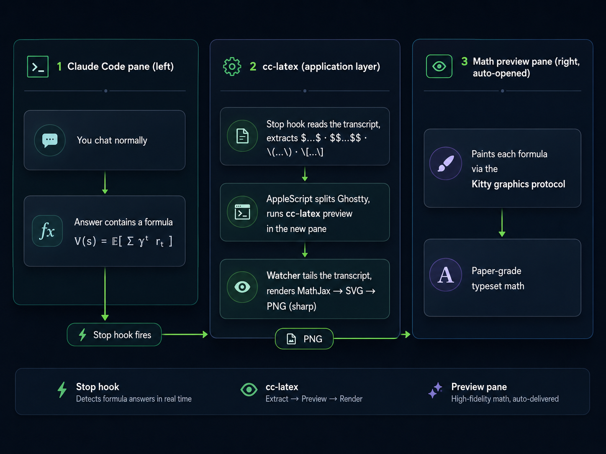

# ghostty-latex-render

[](https://www.npmjs.com/package/ghostty-latex-render)

**English** · [简体中文](README.zh-CN.md)

Auto-render the LaTeX in Claude Code answers as **paper-grade math images**, live, in a
**Ghostty split pane** — no terminal fork, no leaving the terminal.

Install it, run `cc-latex setup` once, and from then on: whenever a Claude Code answer in
Ghostty contains a formula, a side pane opens by itself and shows the typeset math. Later
answers update the same pane.



See [`docs/ghostty-latex-render-design.md`](docs/ghostty-latex-render-design.md) for the
full design rationale.

## How it works

<p align="center">
  
</p>

- **Detection** happens in the application layer: a Claude Code **`Stop` hook** reads the
  finished answer's transcript and extracts `$…$` / `$$…$$` / `\(…\)` / `\[…\]`.
- **The split** is opened via **Ghostty's native AppleScript** `split` + surface-config
  `command` (Ghostty ≥ 1.3). No keystroke automation, no Accessibility permissions.
- **Rendering** is **MathJax → SVG → PNG** (`sharp`), painted with the **Kitty graphics
  protocol**, which Ghostty supports. No system TeX, no `chafa`/`timg`, no `fswatch`.

Only two npm deps: `mathjax-full` and `sharp`.

## Requirements

- **Ghostty ≥ 1.3** (for the AppleScript `split` command), on macOS.
- **Node ≥ 18.**
- Claude Code, run inside a Ghostty window.

## Install

Install from npm, then register the hook once:

```bash
npm install -g ghostty-latex-render
cc-latex setup
```

<details>
<summary>Install from source instead</summary>

```bash
git clone https://github.com/YangLiu14/ghostty-latex-render.git
cd ghostty-latex-render
npm install && npm link
cc-latex setup
```
</details>

`setup` writes the hook into `~/.claude/settings.json` (use `--project` for a single
project's `.claude/settings.json`). **Restart any running Claude Code session** so it picks
up the new hook.

That's it. Open Claude Code in Ghostty and ask something with math.

## Verify it works

1. **Ghostty image support** — in a Ghostty window:

   ```bash
   cc-latex demo 'V(s)=\mathbb{E}\left[\sum_{t=0}^{\infty}\gamma^t r_t \mid s_0=s\right]'
   ```

   You should see the typeset formula as an image (not a wall of `_Ga=T,f=100…` text).

2. **Auto-split** — in Ghostty, run Claude Code and ask: *"write the quadratic formula in
   LaTeX"*. When the answer finishes, a right pane should open with the rendered formula.

## Commands

| Command | What it does |
|---|---|
| `cc-latex setup [--project] [--direction right\|left\|up\|down] [--scale N]` | Install the Stop hook. |
| `cc-latex uninstall [--project]` | Remove the hook. |
| `cc-latex status` | Show whether the hook is installed and which previews are live. |
| `cc-latex demo '<tex>'` | Render one formula (smoke test). |
| `cc-latex preview [--session PATH] [--once] [--cols N] [--native]` | Run the watcher manually (normally auto-launched). |

### Navigating multiple formulas

When an answer has more than one formula, the pane shows a **numbered menu**; the selected
formula is enlarged below. In the (auto-opened) pane:

- **Click** a menu row, or press **1–9**, to jump to a formula.
- **`j`/`k`**, the **arrow keys** to move between them.
- **`y`** to copy the focused formula's LaTeX to the clipboard.
- **`q`** to close the pane.

The pane **matches your terminal theme** — it queries Ghostty's background/foreground
(OSC 10/11) and renders the math and chrome to match, falling back to a dark default if the
terminal doesn't answer.

A single formula is just shown directly. An unparseable formula is skipped.
(Non-interactive runs — `--once`, or piped output — render all formulas stacked instead.)

### Sizing

Each formula renders at its **natural size** (derived from the math itself), capped to the
pane width, and re-paints when you resize the pane. Tune the overall size with `--scale`
(default `1.0`): bigger e.g. `cc-latex setup --scale 1.4`, smaller `--scale 0.7`. You can
also set `CC_LATEX_SCALE` in the environment.

The auto-opened pane shrinks itself to **~1/3 of the window** on launch (`--fit`), leaving
the Claude Code pane the larger two-thirds. It does this by resizing the split until its
column count hits the target — self-calibrating, so it doesn't depend on display DPI. (Run
`cc-latex preview` manually without `--fit` to keep the default 50/50 split.)

### Which formulas are shown

To cut noise, only **complex** formulas render — those with 2-D / typographic structure that
plain text can't convey (fractions, sums/integrals, matrices, roots, braced sub/superscripts,
real equations). Trivial inline math text already reads fine, so it's skipped: a lone symbol
(`$x$`, `$\gamma$`), a simple sub/superscript (`$x_i$`, `$x^2$`), or a simple product
(`$ab$`, `$a\cdot b$`).

If an answer has only trivial math, no pane opens. To render **everything**, pass `--all`
(`cc-latex preview --all`) or set `CC_LATEX_ALL=1` in the environment before starting Claude
Code (the auto-opened pane inherits it).

## Uninstall

```bash
cc-latex uninstall                 # remove the Stop hook from ~/.claude/settings.json
cc-latex uninstall --project       # ...or from this project's .claude/settings.json

npm uninstall -g ghostty-latex-render   # if installed globally
npm unlink -g ghostty-latex-render      # if you used `npm link`

rm -rf "$TMPDIR/cc-latex"          # optional: clear lock/log/wrapper files
```

`cc-latex uninstall` only strips our own hook entry — it leaves any other hooks in your
`settings.json` untouched. Run `cc-latex status` to confirm it's gone. Close any open
preview panes (or press `q` in them).
